# Video-Sync (bili-download)

<div align="center">

**专为 NAS 用户设计的哔哩哔哩视频同步工具**

一个功能强大的 B 站视频自动化下载与管理工具，支持与 Emby/Jellyfin 等媒体服务器无缝集成

[](https://go.dev/)
[](https://vuejs.org/)
[](https://www.postgresql.org/)
[](LICENSE)

[功能特性](#功能特性) • [快速开始](#快速开始) • [使用指南](#使用指南) • [部署方式](#部署方式) • [文档](#文档)

</div>

---

## 功能特性

### 核心功能

- 🎯 **多种视频源支持**

  - 收藏夹自动同步
  - UP主全部投稿追踪
  - 视频合集批量下载
  - 单个视频快速下载
- 📦 **智能自动化**

  - 定时扫描和下载，无需手动操作
  - 支持断点续传，网络波动不影响下载
  - 智能过滤：按时长、分区、标题等条件筛选
  - 去重检测，避免重复下载
- 🎬 **媒体库友好**

  - 自动生成 NFO 元数据（Kodi 格式）
  - 自动下载视频封面和 UP 主头像
  - 标准化文件命名，适配 Emby/Jellyfin/Plex
  - 目录结构可自定义

### 下载与处理

- 🚀 **高效下载引擎**

  - 基于 yt-dlp，稳定可靠
  - 支持多种视频质量选择（4K/1080P/720P）
  - 并发下载控制，合理利用带宽
  - 自动重试机制
- 💬 **弹幕支持**

  - 自动下载 XML 弹幕文件
  - 转换为 ASS 字幕格式
  - 支持弹幕样式自定义

### 管理与监控

- 🎨 **现代化 Web 界面**

  - 直观的仪表盘，一目了然
  - 任务源可视化管理
  - 下载任务实时监控
  - 视频库浏览与搜索
  - 扫码登录，配置简单
- 📊 **数据统计**

  - 下载量统计
  - 存储空间占用分析
  - 任务成功率监控

### 部署与扩展

- 🐳 **容器化部署**

  - Docker 一键部署
  - Docker Compose 多容器编排
  - Alpine Linux 镜像，体积小巧
  - 健康检查与自动重启
- 🔧 **高度可配置**

  - YAML 配置文件
  - 环境变量支持
  - 热重载配置（部分配置）

---

## 项目预览

### 仪表盘

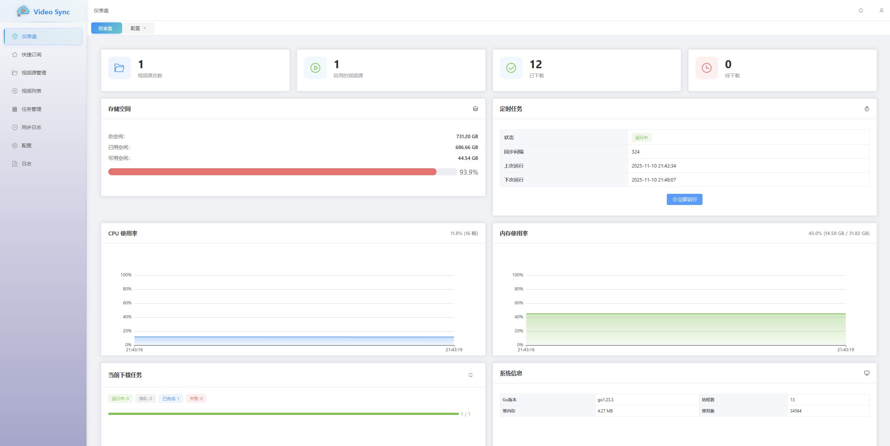

### 快捷订阅

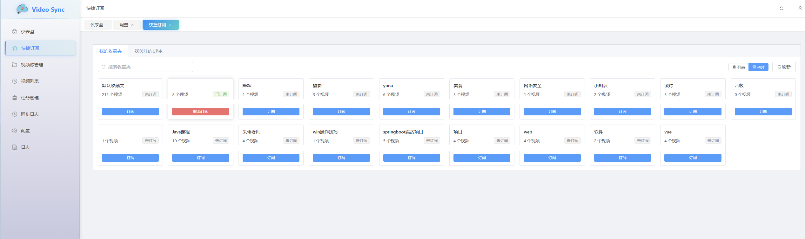
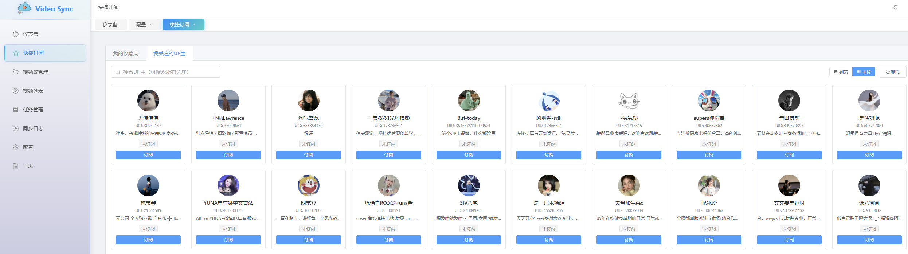

### 任务源管理

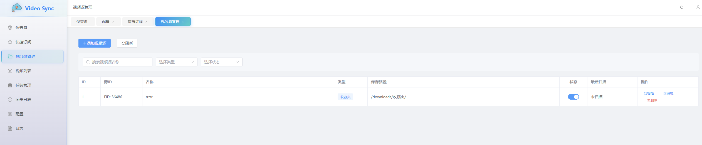

### 视频列表

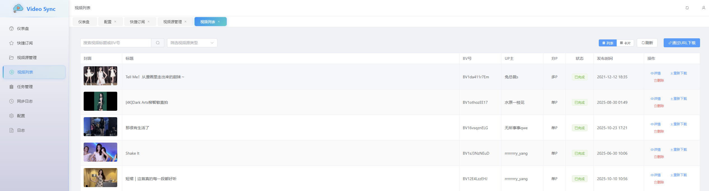

### 任务管理

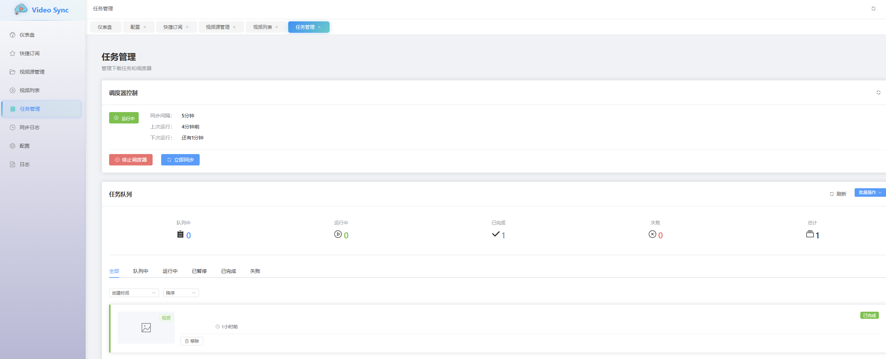

### 配置中心

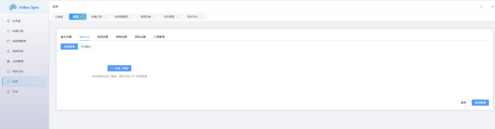
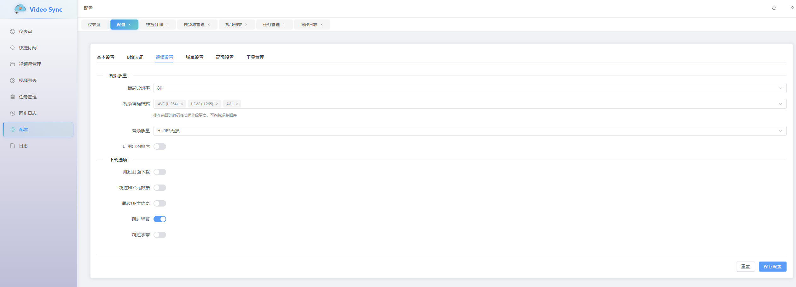
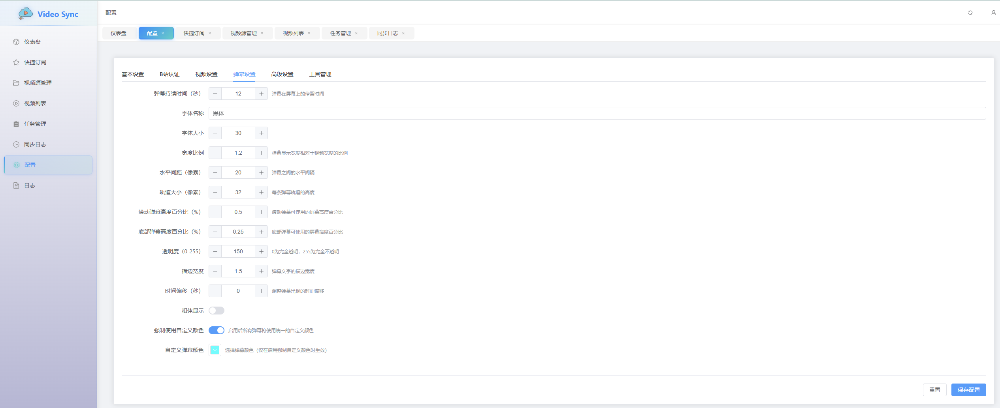
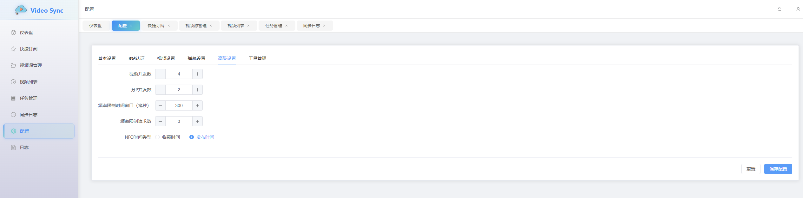
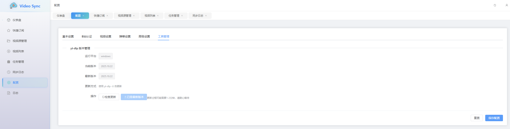

---

## 技术栈

### 后端

- **语言**: Go 1.23.3+
- **框架**: Gin (HTTP Server)
- **数据库**: PostgreSQL 16+ with GORM
- **配置**: Viper
- **其他**: WebSocket 实时通信

### 前端

- **框架**: Vue 3 (Composition API)
- **构建工具**: Vite 5
- **UI 组件**: Element Plus
- **状态管理**: Pinia
- **图表**: ECharts

### 下载工具

- **下载引擎**: yt-dlp
- **视频处理**: FFmpeg
- **弹幕转换**: 内置转换器

---

## 快速开始

### 方式一：Docker Compose（推荐）

适合快速部署和生产环境使用。

```bash
# 1. 克隆仓库
git clone https://github.com/your-org/video-sync.git
cd video-sync

# 2. 启动服务（包含应用和数据库）
docker-compose up -d

# 3. 查看日志
docker-compose logs -f app

# 4. 访问 Web 界面
# 浏览器打开: http://localhost:8080
```

首次启动后，访问配置页面使用扫码登录即可。

### 方式二：从源码构建

适合开发和自定义需求。

#### 前置要求

- Go 1.23.3+
- Node.js 18+
- PostgreSQL 16+
- yt-dlp
- FFmpeg

#### 构建步骤

```bash
# 1. 克隆仓库
git clone https://github.com/your-org/video-sync.git
cd video-sync

# 2. 安装后端依赖
go mod download

# 3. 构建前端
cd web
npm install
npm run build
cd ..

# 4. 构建后端
go build -o video-sync cmd/server/main.go

# 5. 准备配置文件
mkdir -p configs
cp .env.example configs/config.yaml
# 编辑 configs/config.yaml 配置数据库连接等

# 6. 初始化数据库
# 确保 PostgreSQL 已运行，创建数据库
createdb video_sync
psql video_sync < bili-sync-schema.sql

# 7. 运行应用
./video-sync
```

#### 开发模式

```bash
# 后端开发（热重载）
go run cmd/server/main.go

# 前端开发（热重载）
cd web
npm run dev
```

---

## 部署方式

### Docker 部署

详细的 Docker 部署说明请参考 [DOCKER.md](DOCKER.md)

**快速部署命令**：

```bash
# 使用 Docker Compose（包含数据库）
docker-compose up -d

# 或者使用单独的镜像（需要自己配置数据库）
docker run -d \
  --name video-sync \
  -p 8080:80 \
  -e DB_HOST=your-db-host \
  -e POSTGRES_USER=postgres \
  -e POSTGRES_PASSWORD=your-password \
  -e POSTGRES_DB=video_sync \
  -v ./downloads:/downloads \
  -v ./metadata:/metadata \
  -v ./configs:/app/configs \
  -v ./logs:/var/log/bili-sync \
  video-sync:latest
```

### 目录挂载说明


| 容器路径             | 宿主机路径    | 说明             |
| -------------------- | ------------- | ---------------- |
| `/downloads`         | `./downloads` | 视频下载目录     |
| `/metadata`          | `./metadata`  | UP主信息和元数据 |
| `/app/configs`       | `./configs`   | 配置文件目录     |
| `/var/log/bili-sync` | `./logs`      | 应用日志         |

---

## 配置

### 配置文件

首次运行时，应用会在 `configs/` 目录下生成默认配置文件 `config.yaml`。

**关键配置项**：

```yaml
# 服务器配置
server:
  port: 8080
  mode: release  # debug, release

# 数据库配置
database:
  host: "localhost"
  port: 5432
  user: "postgres"
  password: "your_password"
  dbname: "video_sync"
  sslmode: "disable"

# B站认证（通过 Web 界面扫码登录）
bilibili:
  credential:
    sessdata: ""
    bili_jct: ""
    buvid3: ""
    dedeuserid: ""
    ac_time_value: ""

# 下载路径配置
paths:
  download_base: "/downloads/bilibili"  # 视频下载根目录
  upper_path: "/metadata/people"         # UP主信息目录

# 下载配置
download:
  video_quality: "1080p"  # 4k, 1080p, 720p, 480p
  concurrent_limit: 3      # 并发下载数
  retry_times: 3          # 失败重试次数

# 同步配置
sync:
  interval: 3600  # 扫描间隔（秒）
  auto_start: true # 启动时自动开始同步
```

### 环境变量

支持通过环境变量覆盖数据库配置：

```bash
export DB_HOST=postgres
export DB_PORT=5432
export POSTGRES_USER=postgres
export POSTGRES_PASSWORD=your_password
export POSTGRES_DB=video_sync
export APP_PORT=8080
```

Docker 部署时在 `docker-compose.yml` 中配置。

---

## 使用指南

### 1. 首次配置

访问 Web 界面后：

1. 进入 **配置中心**
2. 点击 **扫码登录** 获取 B 站凭证
3. 配置下载路径和质量偏好
4. 保存配置

> 💡 **提示**: 关于 Cookie 的详细获取方法，请参考 [HOW_TO_GET_COOKIES.md](HOW_TO_GET_COOKIES.md)

### 2. 添加视频源

#### 方式一：快捷订阅

1. 点击顶部导航的 **快捷订阅**
2. 输入 B 站 URL（支持收藏夹、UP主主页、视频合集等）
3. 点击 **立即订阅**

#### 方式二：手动添加

1. 进入 **任务源管理**
2. 点击 **添加任务源**
3. 选择类型（收藏夹/UP主/合集）
4. 填写对应的 ID 或 URL
5. 配置下载规则（可选）：
   - 按时长过滤
   - 按分区过滤
   - 按标题关键词过滤
6. 保存

### 3. 视频下载

#### 自动下载

- 应用会按照配置的同步间隔自动扫描任务源
- 新视频会自动加入下载队列
- 在 **任务管理** 页面查看下载进度

#### 手动下载

1. 进入 **视频列表**
2. 选择想要下载的视频
3. 点击 **立即下载**

### 4. 媒体服务器集成

下载的视频会按照以下结构组织：

```
downloads/
└── [任务源名称]/
    └── [视频标题]/
        ├── [视频标题].mp4           # 视频文件
        ├── [视频标题].nfo           # 元数据文件
        ├── [视频标题]-poster.jpg   # 封面图
        └── [视频标题].zh-CN.ass    # 弹幕字幕（可选）
```

#### 在 Emby 中添加媒体库

1. 打开 Emby 管理后台
2. 进入 **媒体库** → **添加媒体库**
3. 选择 **电影** 或 **电视剧** 类型
4. 添加文件夹：选择 `downloads/` 目录
5. 元数据下载器：禁用在线下载器（使用本地 NFO）
6. 保存并扫描媒体库

Jellyfin 和 Plex 的配置方法类似。

---

## 常见问题

### Q: 如何获取 B 站凭证？

**A**: 有两种方式：

1. **推荐**: 使用 Web 界面的 **扫码登录** 功能，自动获取
2. 手动获取：参考 [HOW_TO_GET_COOKIES.md](HOW_TO_GET_COOKIES.md)

### Q: 如何获取收藏夹/UP主 ID？

**A**:

- **收藏夹**: 打开收藏夹页面，URL 中 `fid=` 后面的数字
  - 示例: `https://space.bilibili.com/xxx/favlist?fid=123456789` → ID 是 `123456789`
- **UP主**: UP主主页 URL 中的数字
  - 示例: `https://space.bilibili.com/123456` → ID 是 `123456`

### Q: 下载失败怎么办？

**A**: 检查以下几点：

1. ✅ 确认 yt-dlp 已正确安装（Docker 部署无需关注）
2. ✅ 检查 B 站凭证是否有效（在配置页面重新扫码登录）
3. ✅ 查看日志文件查找具体错误信息
4. ⚠️ 可能触发了 B 站风控，建议等待一段时间后重试

### Q: 如何更改下载质量？

**A**:

1. 进入 **配置中心**
2. 找到 **下载配置** → **视频质量**
3. 选择期望的质量（4K/1080P/720P/480P）
4. 保存配置

### Q: 支持哪些视频网站？

**A**: 目前专注于 B 站，未来可能支持更多平台。

### Q: Docker 容器重启后数据会丢失吗？

**A**: 不会。只要正确挂载了数据卷，数据会持久化保存。

### Q: 如何升级到最新版本？

**A**:

```bash
# Docker Compose 方式
git pull
docker-compose pull
docker-compose up -d

# 从源码
git pull
go build -o video-sync cmd/server/main.go
systemctl restart video-sync
```

---

## 文档

- [Docker 部署指南](DOCKER.md) - 详细的 Docker 部署说明
- [Cookie 获取教程](HOW_TO_GET_COOKIES.md) - 如何手动获取 B 站 Cookie

---

## 项目结构

```
video-sync/
├── cmd/                      # 程序入口
│   └── server/
│       └── main.go
├── internal/                 # 内部包
│   ├── adapter/             # 视频源适配器（收藏夹、UP主等）
│   ├── api/                 # HTTP API 和路由
│   ├── bilibili/            # B 站 API 客户端
│   ├── config/              # 配置管理
│   ├── database/            # 数据库模型和操作
│   ├── downloader/          # 下载器核心逻辑
│   ├── danmaku/             # 弹幕处理
│   ├── nfo/                 # NFO 元数据生成
│   ├── scheduler/           # 定时任务调度
│   └── utils/               # 工具函数
├── web/                     # 前端代码
│   ├── src/
│   │   ├── components/      # Vue 组件
│   │   ├── views/           # 页面视图
│   │   ├── stores/          # Pinia 状态管理
│   │   └── router/          # 路由配置
│   └── package.json
├── configs/                 # 配置文件目录
├── downloads/               # 视频下载目录
├── metadata/                # 元数据目录
├── logs/                    # 日志目录
├── migrations/              # 数据库迁移脚本
├── Dockerfile               # Docker 镜像构建文件
├── docker-compose.yml       # Docker Compose 配置
├── go.mod                   # Go 依赖管理
└── README.md               # 本文档
```

---

## 开发

### 本地开发环境

```bash
# 安装依赖
go mod download
cd web && npm install

# 运行后端（端口 8080）
go run cmd/server/main.go

# 运行前端（端口 5173，开发服务器）
cd web && npm run dev
```

### 构建

```bash
# 构建后端
go build -o video-sync cmd/server/main.go

# 构建前端
cd web && npm run build

# 构建 Docker 镜像
docker build -t video-sync:latest .

# 构建多架构镜像
docker buildx build --platform linux/amd64,linux/arm64 -t video-sync:latest .
```

### 代码规范

```bash
# Go 代码格式化
go fmt ./...

# Go 代码检查
go vet ./...

# 前端代码检查
cd web && npm run lint
```

---

## 贡献

欢迎提交 Issue 和 Pull Request！

### 贡献指南

1. Fork 本仓库
2. 创建特性分支 (`git checkout -b feature/AmazingFeature`)
3. 提交更改 (`git commit -m 'Add some AmazingFeature'`)
4. 推送到分支 (`git push origin feature/AmazingFeature`)
5. 开启 Pull Request

---

## 致谢

本项目受到以下优秀项目的启发：

- [bili-sync](https://github.com/amtoaer/bili-sync) - 原项目灵感来源
- [yt-dlp](https://github.com/yt-dlp/yt-dlp) - 强大的视频下载工具
- [bilibili-API-collect](https://github.com/SocialSisterYi/bilibili-API-collect) - B 站 API 文档

---

## 免责声明

- 本项目仅供个人学习和研究使用，请勿用于商业用途
- 下载的视频内容版权归原作者所有，请尊重原作者的劳动成果
- 使用本工具下载视频时，请遵守相关法律法规和 B 站用户协议
- 请勿使用本工具进行大规模爬取，以免对 B 站服务器造成压力
- 因使用本工具产生的任何问题，开发者不承担任何责任

---

## 许可证

本项目采用 MIT 许可证。详见 [LICENSE](LICENSE) 文件。

---

<div align="center">

**如果这个项目对你有帮助，请给它一个 ⭐️**

Made with ❤️ by the community

</div>
